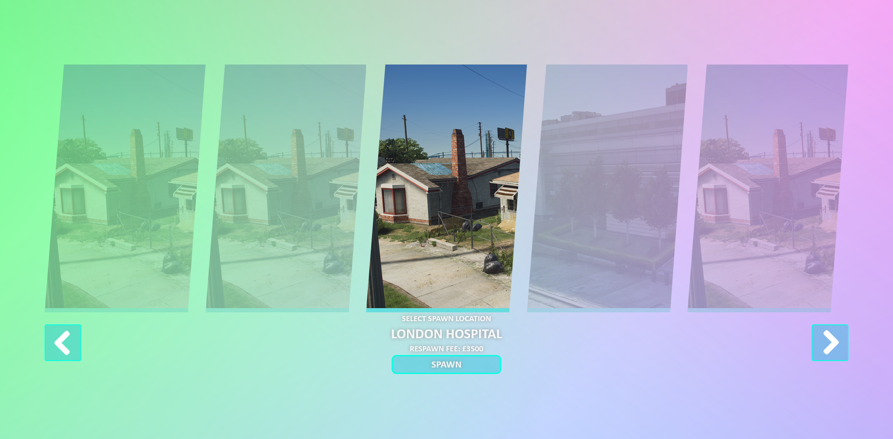

# FiveM-Spawn-UI

- A simple spawn ui you can use on your FiveM server - this was created as a project to learn more about JS frameworks (Svelte in this case)

# Features 
- Easily configurable
- Lightweight and performant

# Usage
- bun i (install the packages/node_modules)
- bun run dev (run the website in development mode)
- bun run build (builds the website into a dist/ directory)
